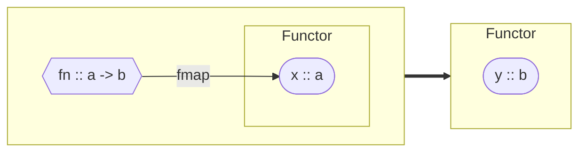
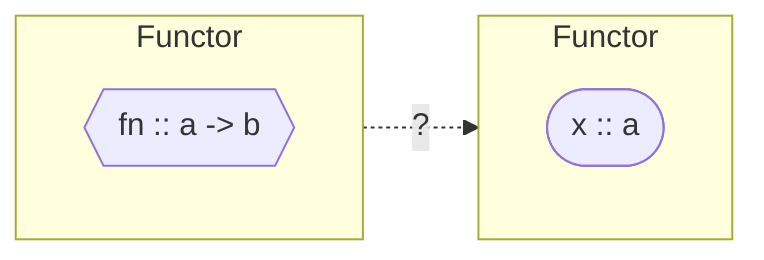
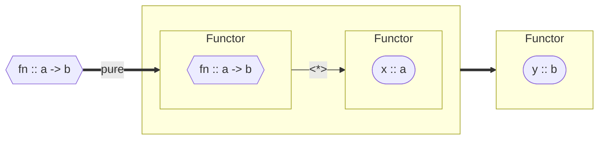
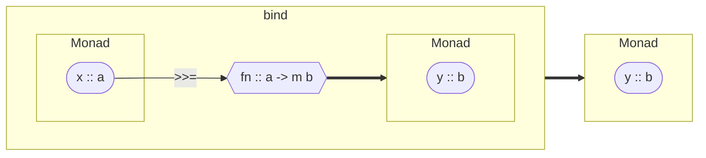
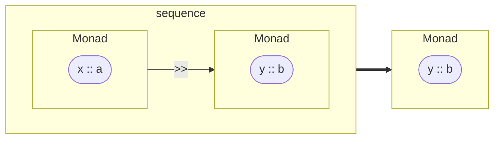
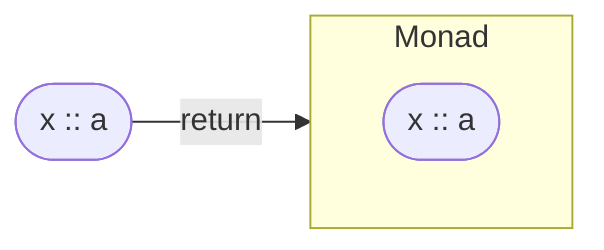
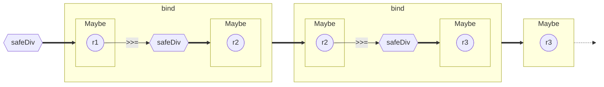

# Functors, Applicatives, and Monads
## CS 340: Programming Patterns and Paradigms
Michael Lee <lee@iit.edu>

## Agenda

- Functors
- Applicatives
- Monads
- Laws

## Functors

### Motivation: Mapping

`map` is a super useful HOF --- we can apply arbitrary functions to the
*contents* of a list without traversing the list ourselves.

```haskell
map :: (a -> b) -> [a] -> [b]
```

Wouldn't it be cool if we could *generalize* this idea of mapping an HOF over
the contents of an arbitrary "container"?

### Central idea

A functor is a class that supports a "mapping" operation, whereby a function can
be applied to the value(s) contained by the functor without changing its
structure.

We can think of a functor, more generally, as a *context* for some value.

### Definition

```haskell
class Functor f where
  fmap :: (a -> b) -> f a -> f b
```

- `fmap` is the name of the mapping operation

- Note that the *kind* of `f` must be `* -> *`, for `f a` and `f b` to make
  sense in the type declaration of `fmap`.



### List as a Functor

A list functor instance behaves just like `map`:

```haskell
instance Functor [] where
  fmap :: (a -> b) -> [a] -> [b]
  fmap _ [] = []
  fmap f (x:xs) = f x : fmap f xs
```

Or just:

```haskell
instance Functor [] where
  fmap :: (a -> b) -> [a] -> [b]
  fmap = map
```

So we can do:

```haskll
fmap even [1..5] --> [False, True, False, True, False]
```

### Maybe as a Functor

A `Maybe` contains either a value (in a `Just`) or `Nothing` (no value at all).

```haskell
instance Functor Maybe where
  fmap :: (a -> b) -> Maybe a -> Maybe b
  fmap _ Nothing  = Nothing -- nothing to map over
  fmap f (Just x) = Just $ f x
```

So we can do:

```haskell
fmap even Nothing --> Nothing
fmap even $ Just 42 --> Just True
```

### The `<$>` operator

Just as `$` represents "pure" function application, we can define the `<$>`
operator to represent function application to values inside functors:

```haskell
infixl 4 <$>
(<$>) :: Functor f => (a -> b) -> f a -> f b
(<$>) = fmap
```

So we can do:

```haskell
reverse <$> Nothing  ==  Nothing

reverse <$> Just "Aloha"  ==  Just "aholA"

reverse <$> ["cadabra", "tacocat"]  ==  ["arbadac", "tacocat"]
```

### Tree as a Functor

A `Tree` is a more complex, homogeneous self-referential structure.

```haskell
data Tree a = Node a [Tree a] | Leaf a
```

Can you make `Tree` a functor?

```haskell
instance Functor Tree where
  fmap :: (a -> b) -> Tree a -> Tree b
  fmap f (Leaf x)    = Leaf $ f x
  fmap f (Node x ts) = Node (f x) ((f <$>) <$> ts)
```

So we can do:

```haskell
length <$> Node "Animalia" [
             Node "Arthropoda" [
               Leaf "Arachnida",
               Leaf "Insecta"
             ],
             Node "Chordata" [
               Leaf "Amphibia",
               Leaf "Mammalia"
             ]
           ]
```

Which yields:

```haskell
Node 8 [
  Node 10 [
    Leaf 9,
    Leaf 7
  ],
  Node 8 [
    Leaf 8,
    Leaf 8
  ]
]
```

### Functions as Functors!

A function with type `a -> b` is a container for its eventual result.

- How do we get at its contents?

- How would you make `a -> b` a functor?

```haskell
instance Functor ((->) a) where
  fmap :: (b -> c) -> (a -> b) -> (a -> c)
  fmap g f = \x -> g (f x)

  -- equivalent to:
  fmap g f = g . f

  -- equivalent to:
  fmap = (.)
```

A new, novel way of interpreting composition:

```haskell
((2*) <$> (5+) <$> (100-)) 90
```

### Limitations

Functors allow us to apply pure functions to "boxed" values.

But what if the functions are themselves boxed?

- This might happen if we partially apply a function (via `<$>`) to a functor



## Applicative Functors

### Central idea

Applicative functors are augmented so as to support operations *between*
functors.

### Definition

```haskell
class Functor f => Applicative f where
  pure :: a -> f a

  (<*>) :: f (a -> b) -> f a -> f b
```

1. `pure` takes a value and wraps it in a functor instance
2. `<*>` applies a function inside one functor to a value inside another functor



### Maybe as an Applicative

```haskell
instance Applicative Maybe where
  pure :: a -> Maybe a
  pure = Just

  (<*>) :: Maybe (a -> b) -> Maybe a -> Maybe b
  Nothing  <*> _        = Nothing
  _        <*> Nothing  = Nothing
  (Just f) <*> (Just x) = Just $ f x
```

### Using the Maybe Applicative

Consider:

```haskell
pure 42 :: Maybe Int

pure (3*) <*> Just 7

(*) <$> Just 3 <*> Just 7

(\x y z -> x+y*z) <$> Just 2 <*> Just 3 <*> Just 4
```

What happens if any of the values are `Nothing`?

```haskell
(*) <$> Nothing <*> Just 7

(\x y z -> x+y*z) <$> Just 2 <*> Nothing <*> Just 4
```

### List as an Applicative

Can you make `[a]` an instance of `Applicative`?

Consider:

- What should `pure even <*> [1..10]` do?
- What should `[(2*), (5+)] <*> [1, 3, 10]` do?

```haskell
instance Applicative [] where
  pure :: a -> [a]
  pure x = [x]

  (<*>) :: [a -> b] -> [a] -> [b]
  [] <*> _  = []
  _  <*> [] = []
  fs <*> xs = [f x | f <- fs, x <- xs]
```

So we can do:

```haskell
pure (+) <*> [1,2] <*> [10,20]  ==  [11,21,12,22]
```

### "lift"-ing functions

For convenience, we can define utility functions that *lift* pure functions to
work with values in an `Applicative` context.

```haskell
liftA2 :: Applicative f => (a -> b -> c) -> f a -> f b -> f c
liftA2 f x y = f <$> x <*> y
```

So we can do:

```haskell
liftA2 (+) (Just 3) (Just 5)  ==  Just 8
liftA2 (+) [1,2] [10,20]      ==  [11,21,12,22]
```

Which is arguably more readable and expressive than:

```haskell
(+) <$> (Just 3) <*> (Just 5)
(+) <$> [1,2] <*> [10,20]
```

Sometimes we talk about "lifting" or "lifted" functions, which are just pure
functions adapted for use in other contexts.

### Limitations

So far, we've used `<$>` and `<*>` with functions that act on and return values
which sit "inside" contexts.

But what happens when we use a function that creates its own context?

E.g., recall the `find` function:

```haskell
find :: (a -> Bool) -> [a] -> Maybe a
find _ [] = Nothing
find p (x:xs) | p x = Just x
              | otherwise = find p xs
```

What are the results of the following expressions?

```haskell
find even <$> Just [1..10]

pure (find even) <*> Just [1,3..9]
```

Answer:

```haskell
Just (Just 2)

Just Nothing
```

Weird! We want the final context to be "merged" with the result of the function
(which generates its own context).

## Monads

### Central idea

A monad is a functor that represents a *computation* (aka *action*) that results
in a value in some context.

Monad operations allow us to chain together a series of computations,
propagating their results as needed, and updating the context.

### Definition

```haskell
class Applicative m => Monad m where
  (>>=) :: m a -> (a -> m b) -> m b

  (>>) :: m a -> m b -> m b
  x >> y = x >>= \_ -> y

  return :: a -> m a
  return = pure
```

- `>>=` : *bind* -- runs a function on the value in monad `m a`, which returns a
  value in its own context; these contexts are merged into the result `m b`
- `>>` : *sequence* -- chains together two monadic actions, throwing away the
  result of the first, but merging their contexts
- `return` is just a synonym for `pure`

### Visualization







### Maybe instance of Monad

```haskell
instance Monad Maybe where
  (>>=) :: Maybe a -> (a -> Maybe b) -> Maybe b
  Nothing >>= _ = Nothing
  Just x  >>= f = f x
```

Now we get sensible results by doing:

```haskell
Just [1..10] >>= find even  == Just 2

Just [1,3..9] >>= find even == Nothing

Nothing >>= find even       == Nothing
```

### An extended example

Consider `div`, which throws an exception if the denominator is 0.

```haskell
div :: Integral a => a -> a -> a
```

We can improve on this by writing `safeDiv` as follows:

```haskell
safeDiv :: Integral a => a -> a -> Maybe a
safeDiv _ 0 = Nothing
safeDiv x y = Just $ x `div` y
```

Now consider implementing the following function using `safeDiv`:

```latex +render +no_background
\[ f(a,b,c,d,e,f) = \frac{\frac{a}{b} + \frac{c}{d}}{e} \times f \]
```

### An extended example (cont.)

```latex +render +no_background
\[ f(a,b,c,d,e,f) = \frac{\frac{a}{b} + \frac{c}{d}}{e} \times f \]
```

Take 1 (explicit pattern-matching):

```haskell
fDivs :: Integral a => a -> a -> a -> a -> a -> a -> Maybe a
fDivs a b c d e f =
  case a `safeDiv` b
  of Nothing -> Nothing
     Just r1 -> case c `safeDiv` d
                of Nothing -> Nothing
                   Just r2 -> case (r1+r2) `safeDiv` e
                              of Nothing -> Nothing
                                 Just r3 -> Just (r3*f)
```

**Yuck!!!**

### An extended example (cont.)

Take 2 (using *bind*):

```haskell
fDivs :: Integral a => a -> a -> a -> a -> a -> a -> Maybe a
fDivs a b c d e f = a `safeDiv` b >>= \r1 ->
                       (c `safeDiv` d >>= \r2 ->
                          ((r1+r2) `safeDiv` e >>= \r3 ->
                             (return (r3 * f))))
```

`>>=` takes care of merging the contexts of the results (i.e., `Nothing` or
`Just X`) correctly. I.e., the "monadic machinery" allows us to just focus on
working with the results (and ignoring failure/success).

Here's a (slightly simplified) visual:



### An extended example (cont.)

Take 2 (using *bind*):

```haskell
fDivs :: Integral a => a -> a -> a -> a -> a -> a -> Maybe a
fDivs a b c d e f = a `safeDiv` b >>= \r1 ->
                       (c `safeDiv` d >>= \r2 ->
                          ((r1+r2) `safeDiv` e >>= \r3 ->
                             (return (r3 * f))))
```

We can rewrite the above as follows:

```haskell
fDivs :: Integral a => a -> a -> a -> a -> a -> a -> Maybe a
fDivs a b c d e f = a `safeDiv` b >>= \r1 ->
                    c `safeDiv` d >>= \r2 ->
                    (r1+r2) `safeDiv` e >>= \r3 ->
                    return (r3 * f)
```

This pattern is so common, *do-notation* gives us syntactic sugar for it!

```haskell
fDivs :: Integral a => a -> a -> a -> a -> a -> a -> Maybe a
fDivs a b c d e f = do r1 <- a `safeDiv` b
                       r2 <- c `safeDiv` d
                       r3 <- (r1+r2) `safeDiv` e
                       return (r3 * f)
```

## `do` notation

### Binding a result

```haskell
do x <- m
   rest
```

desugars into:

```haskell
m >>= \x -> rest
```

### Sequencing

```haskell
do m
   rest
```

desugars into:

```haskell
m >> rest
```

which is the same as:

```haskell
m >>= \_ -> rest
```

### Local bindings

We can also use `let` to introduce local vars in a `do` block:

```haskell
do let x = y
   rest
```

desugars into:

```haskell
let x = y in rest
```

### Example

Here's an example of a `do` block that uses all the forms of syntactic sugar:

```haskell
foo x y = do r1 <- monadicFn1 x
             let r2 = pureFn1 r1 y
                 z  = pureVal
             (r3:_) <- monadicFn2 r2
             return $ pureFn2 z r3
```

Make sure you can manually *desugar* this into `>>=` and `>>` operations!

## Laws

Instances of Functors, Applicatives, and Monads should conform to a handful of
"laws", which ensure that all class instances behave in a predictable manner.

The compiler does not enforce these laws for us -- it is up to the programmer to
test and ensure they are satisfied!

### Functor laws

#### Identity

```haskell +no_background
fmap id       =  id
```

#### Composition

```haskell +no_background
fmap (f . g)  =  (fmap f . fmap g)
```

### Applicative laws

#### Identity

```haskell +no_background
pure id <*> v               =  v
```

#### Homomorphism

```haskell +no_background
pure f <*> pure x           =  pure (f x)
```

#### Interchange

```haskell +no_background
u <*> pure x                =  pure ($ x) <*> u
```

#### Composition

```haskell +no_background
pure (.) <*> u <*> v <*> w  =  u <*> (v <*> w)
```

### Monad laws

#### Left Identity

```haskell +no_background
return x >>= f             =  f x

-- equivalently:
do y <- return x           =  do f x
   f y
```

#### Right Identity

```haskell +no_background
m >>= return               =  m

-- equivalently:
do x <- m                  =  do m
   return x
```

#### Associativity

```haskell +no_background
(m >>= (\x -> f x))        =  m >>= (\x -> f x
   >>= \y -> g y                        >>= (\y -> g y))

-- equivalently:
do y <- do x <- m          =  do x <- m
           f x                   y <- f x
   g y                           g y
```
