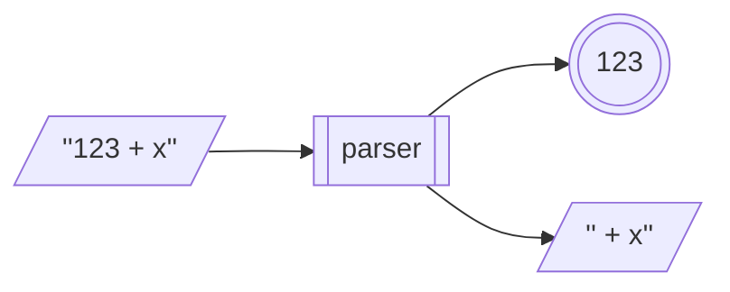

# Monad Transformers

## Agenda

- The problem
- Monad transformers
- State monad transformer
- Parsing
- Other transformers and monad stacks

## The problem

We've amassed a bunch of really useful monads:

- `[]`
- `Maybe`
- `Logger`
- `State`
- `IO`

But there's no way to *combine* the effects of one with another!

E.g., we might want to combine a `Logger` monad with a list (`[]`) monad to log each step taken in a non-deterministic operation.

E.g., we might want to combine a `State` monad with a `Maybe` monad to model stateful computations that might fail.

## A naive solution

We could try to combine monads by directly embedding them. E.g., for `State` and `Maybe`:

```haskell
type StatefulMaybe a = State s (Maybe a)
```

What does this describe? Is this a stateful computation that might fail?

- No! Failure isn't part of the monad; it's just a value in the result. The state is still updated and propagated regardless of success or failure.

- We would like failure to *short-circuit* the computation: if something fails, the computation should stop and the state shouldn't be updated further.

We want to *compose* the effects of `State` and `Monad`, rather than just embed the latter in the first!

## Monad transformers

A monad transformer allows you to *stack monadic effects* by wrapping one monad around another.

- More concretely, a monad transformer takes a monad `m`, and returns a new monad `t m` that adds an effect to that monad.

E.g., consider the original `State` type:

```haskell
newtype State s a = State { runState :: s -> (a, s) }
```

The `StateT` monad transformer generalizes this by letting the output live inside another monad `m`:

```haskell
newtype StateT s m a = StateT { runStateT :: s -> m (a, s) }
```

- `m` is the *base* or *inner* monad
- the `Functor`, `Applicative`, and `Monad` instances must carefully *thread state* and also *sequence effects* from `m`

## State monad transformer

```haskell
newtype StateT s m a = StateT { runStateT :: s -> m (a, s) }
```

E.g., we could stack `StateT` with the `Maybe` monad to define a stateful computation that might fail, like so:

```haskell
pop :: StateT [a] Maybe a
pop = StateT $ \s -> case s of
                       [] -> Nothing
                       (x:xs) -> Just (x, xs)

push :: a -> StateT [a] Maybe ()
push x = StateT $ \s -> Just ((), x:s)
```

### Functor/Applicative/Monad instances

Here's the original `State` instance of `Functor`:

```haskell
instance Functor (State s) where
  fmap :: (a -> b) -> State s a -> State s b
  fmap f (State st) = State $ \s -> let (x, s') = st s
                                    in (f x, s')
```

The `StateT` instance needs to do the same, while also sequencing the inner monad:

```haskell
instance (Monad m) => Functor (StateT s m) where
  fmap :: (a -> b) -> StateT s m a -> StateT s m b
  fmap f (StateT st) = StateT $ \s ->  do (x, s') <- st s
                                          return (f x, s')
```

Can you implement the `Applicative` and `Monad` instances of `StateT`?

### Using StateT

With working instances, we can now do:

```haskell
stackOps :: StateT [Int] Maybe ()
stackOps = push 1 >> pop >> pop >> push 2


-- use stackOps

runStateT stackOps [1]  ==  Just ((), [2])

runStateT stackOps []   ==  Nothing
```

- In this example, `Maybe` handles failure (e.g., popping from an empty stack)
- `StateT` keeps track of the stack across steps

## Parsing

A *parser* is a stateful computation that takes as its input state a string, and attempts to extract (parse) a structured value from the beginning of that string, and returns the remaining unconsumed input string along with the parsed value.

E.g., an integer parser run on an input string:



A parser is just a `State` + `Maybe` monad stack!

```haskell
type Parser a = StateT String Maybe a
```

### A single character parser

A single character parser:

```haskell
char :: Parser Char
char = StateT $ \s -> case s of ""     -> Nothing
                                (c:cs) -> Just (c,cs)

parse = runStateT -- for legibility
```

So we can do:

```haskell
parse char ""  ==  Nothing

parse char "hello"  ==  Just ('h',"ello")
```

### Chaining parsers

Because `Parser`s are monads, we can write:

```haskell
threeChars :: Parser (Char,Char,Char)
threeChars = do c1 <- char
                c2 <- char
                c3 <- char
                return (c1,c2,c3)

parse threeChars "hello"  ==  Just (('h','e','l'),"lo")
```

### Basic parsers

Parsing a character using a predicate:

```haskell
sat :: (Char -> Bool) -> Parser Char
sat p = do c <- char
           if p c then return c else fail

fail :: Parser a
fail = StateT $ \s -> Nothing
```

So we can do:

```haskell
parse (sat (== 'a')) "hello"  ==  Nothing

parse (sat (== 'a')) "aloha"  ==  Just ('a',"loha")

parse (sat isDigit)  "aloha"  ==  Nothing

parse (sat isDigit)  "123"    ==  Just ('1',"23")
```

### String parser

We can use `sat` to write some more parsers:

```haskell
string :: String -> Parser String
string "" = return ""
string (x:xs) = do sat (== x)
                   string xs
                   return (x:xs)
```

So we can do:

```haskell
parse (string "hello") "hello world"  ==  Just ("hello"," world")

parse (string "hello") "aloha world"  ==  Nothing
```

### Utility functions

We can implement some utility functions that combine parsers:

```haskell
(<|>) :: Parser a -> Parser a -> Parser a
p <|> q = StateT $ \s -> case parse p s of
                           Nothing -> parse q s
                           Just x  -> Just x

oneOrMore :: Parser a -> Parser [a]
oneOrMore p = do x <- p
                 xs <- oneOrMore p <|> return []
                 return $ x:xs

zeroOrMore :: Parser a -> Parser [a]
zeroOrMore p = oneOrMore p <|> return []
```

So we can do:

```haskell
parse (string "hi" <|> string "bye") "bye!" ==  Just ("bye","!")

parse (oneOrMore $ sat isDigit) "123hi"     ==  Just ("123","hi")

parse (zeroOrMore $ sat isSpace) "  bye!"   ==  Just ("  ","bye!")
```

### More parsers

And now we can implement more complex parsers!

```haskell
int :: Parser Int
int = do cs <- oneOrMore (sat isDigit)
         return (read cs)

token :: Parser a -> Parser a
token p = do zeroOrMore $ sat isSpace
             x <- p
             zeroOrMore $ sat isSpace
             return x

symbol :: String -> Parser String
symbol s = token (string s)
```

So we can do:

```haskell
parse int "123 + x"                ==  Just (123," + x")

parse (token int) "  123 + x"      ==  Just (123,"+ x")

parse (symbol "foo") "  foo = 10"  ==  Just ("foo","= 10")
```

### Expression parser

Let's write a program to parse and evaluate simple arithmetic expressions.

Start with a data type for representing expressions:

```haskell
data Expr = Lit Int | Add Expr Expr | Sub Expr Expr
```

So an expression like `(5 + 10) - (20 - 2)` would be represented as:

```haskell
Sub (Add (Lit 5) (Lit 10))
    (Sub (Lit 20) (Lit 2))
```

### Expression parser (cont.)

Can you finish implementing the parser?

```haskell
expr :: Parser Expr
expr = do t1 <- term
          op <- sat (== '+') <|> sat (== '-')
          t2 <- term
          return $ (if op == '+' then Add else Sub) t1 t2
       <|>
       term

term :: Parser Expr
term = ?
```

Such that:

```haskell
parse expr "(5+10)-(20-2)" == Just (Sub (Add (Lit 5) (Lit 10))
                                        (Sub (Lit 20) (Lit 2)),"")

parse expr "42+x" == Just (Lit 42,"+x")

parse expr "(1+2" == Nothing
```

### Evaluator

Now the evaluator:

```haskell
eval :: Expr -> Int
eval (Lit i)     = i
eval (Add e1 e2) = eval e1 + eval e2
eval (Sub e1 e2) = eval e1 - eval e2
```

Can you implement `evalString`?

```haskell
evalString :: String -> Maybe Int
evalString = ?
```

Such that:

```haskell
evalString "(5+10)-(20-2)"  ==  Just (-3)

evalString "42+x"           ==  Nothing

evalString "(1+2"           ==  Nothing
```

## State & IO

It is also useful to pair the `State` and `IO` monads, so that we can keep track of ongoing state while interacting with the real world.

In order to work with functions that produce values of the inner monad, it is useful to have a utility to "lift" them into the `StateT` monad:

```haskell
lift :: Monad m => m a -> StateT s m a
lift m = StateT $ \s -> do x <- m
                           return (x, s)
```

### Guessing game with state

Using `lift`, `IO`, and `StateT`, here's an updated guessing game that keeps track of all guesses:

```haskell
guess :: Int -> StateT [Int] IO ()
guess n = do lift $ putStrLn "Enter a guess"
             input <- lift getLine
             case reads input of
               [(g, "")] -> do
                 guesses <- get
                 put (g:guesses)
                 if g < n then do
                   lift $ putStrLn "Too small!"
                   guess n
                 else if g > n then do
                   lift $ putStrLn "Too big!"
                   guess n
                 else do
                   lift $ putStrLn "Good guess!"
               _ -> do
                 lift $ putStrLn "Invalid input."
                 guess n
```

## Plain State Monad?

Now that we have `StateT`, do we still need `State`?

Can we create a plain `State` monad from the `StateT` monad transformer?

We need an inner monad that doesn't add any additional semantics:

```haskell
newtype Identity a = Identity a

instance Functor Identity where
  fmap f (Identity x) = Identity $ f x

instance Applicative Identity where
  pure x = Identity x
  Identity f <*> Identity x = Identity $ f x

instance Monad Identity where
  Identity x >>= f = f x
```

And now we can trivially define `State` as:

```haskell
type State s a = StateT s Identity a
```

## Control.Monad.Trans

The `Control.Monad.Trans` module defines a bunch of monad transformers, including:

- `ListT`, `MaybeT`, `StateT`: the list, maybe, and state monads
- `ReaderT`: reads from an environment/configuration
- `WriterT`: maintains a log of values
- `ExceptT`: helps handle errors during a computation

## Some common stacks

- `StateT s (Either e) a`: A computation that maintains mutable state and can fail with an error.

- `ReaderT r (StateT s IO) a`: A computation with read-only access to a configuration, mutable state, and IO effects.

- `ExceptT e IO a`: A computation that can throw errors during IO operations.

- `MaybeT IO` : A computation that can fail silently (no error message) during IO.

### Rules of thumb

- The outermost monad describes the *primary shape* of the computation.
  - If it's mainly configuration-driven, put `ReaderT` on the outside.
  - If it's mainly errorable, put `ExceptT` on the outside.
  - If state is only an internal detail, `StateT` should be buried deeper.
  - `IO` almost always sits at the bottom.
- Use `lift` (or variants) to lift inner monads up

## Example stack

### ReaderT r (ExceptT e IO) a

A computation that has configuration (`Reader`), errors (`Except`), and `IO` effects.

E.g., could be used to build web API request handlers: access configuration (e.g., database connections), do IO (e.g., DB queries), and fail with meaningful errors. Very common for web frameworks.

Convenience type and associated definitions:

```haskell
type AppM = ReaderT Config (ExceptT AppError IO)

-- Global environment settings
data Config = Config { configApiKey :: String }

-- Custom application errors
data AppError = MissingApiKey | IOError String
```

### Using the stack

Some functions that use the stack:

```haskell
-- A function that needs config and does IO, and may fail
fetchData :: AppM String
fetchData = do
  Config key <- ask -- obtain API key from Reader
  if key == ""
    then throwError MissingApiKey -- error goes to Except
    else liftIO (performApiCall key) -- API call at IO level
```

A runner for the entire stack:

```haskell
runApp :: Config -> AppM a -> IO (Either AppError a)
runApp cfg app = runExceptT (runReaderT app cfg)
```

Which we can call like this:

```haskell
main :: IO ()
main = do
  let cfg = Config { configApiKey = "my-secret-key" }
  result <- runApp cfg fetchData
  case result of
    Left err -> putStrLn $ "Error: " ++ show err
    Right val -> putStrLn $ "Success: " ++ val
```
