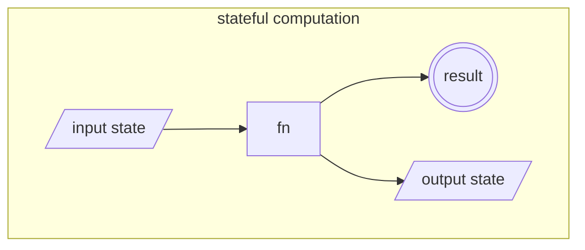
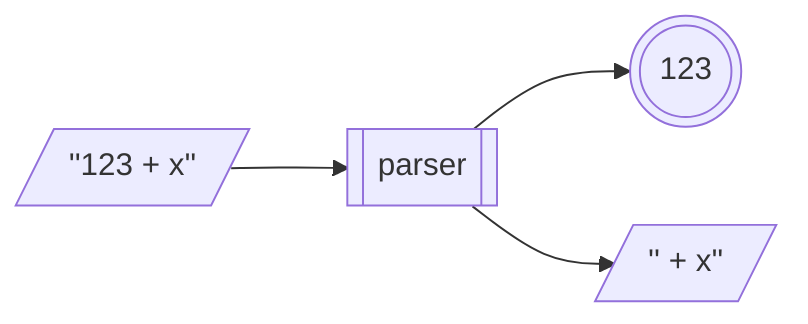

# Agenda

- List
- Logger
- State
- Parser
- IO

---

# List

Recall the following applicative instance of the list type:

```haskell
instance Applicative [] where
  (<*>) :: [a -> b] -> [a] -> [b]
  [] <*> _  = []
  _  <*> [] = []
  fs <*> xs = [f x | f <- fs, x <- xs]
```

So that:

```haskell
(*) <$> [2,4] <*> [5,6,7]  ==  [10,12,14,20,24,28]
```

<!-- pause -->

In the context of applicative functors, a list represents a *non-deterministic*
context -- i.e., multiple *possible* values. And so a computation with a list
explores *every possible result*.

---

# List

## Monad instance

The list monad is consistent with its *non-deterministic* interpretation:

```haskell
instance Monad [] where
  (>>=) :: [a] -> (a -> [b]) -> [b]
  xs >>= f = concat [f x | x <- xs]
```

<!-- pause -->

What do the following evaluate to?

```haskell
-- what is the following in `do` notation?
[3,4,5] >>= \x -> enumFromTo 1 x

-- what is the following in `do` notation?
[3,4,5] >>= \x -> "hi" >>= \y -> return (x,y)

do article   <- ["The", "A", "This"]
   adjective <- ["red", "quick", "fuzzy"]
   noun      <- ["fox", "couch", "torpedo"]
   return $ article ++ " " ++ adjective ++ " " ++ noun
```

---

# Logger

A `Logger` type is a container for a value (of arbitrary type) that also
includes a list of *log messages*.

```haskell
data Logger a = Logger { loggerVal  :: a
                       , loggerMsgs :: [String] }
```

<!-- pause -->

E.g., we might have:

```haskell
lx :: Logger Int
lx = Logger 42 ["Started with 0", "Added 21", "Doubled"]
```

---

# Logger

## Functor instance

- `fmap` (aka `<$>`) should apply a function to the value in a `Logger`

```haskell
instance Functor Logger where
  fmap :: (a -> b) -> Logger a -> Logger b
  fmap f (Logger x l) = Logger (f x) l
```

<!-- pause -->

So we can do:

```haskell
even <$> Logger 42 ["The ultimate answer"]

     ==  Logger True ["The ultimate answer"]
```

---

# Logger

## Applicative instance

- `pure` should place a value in an "empty" `Logger` (with no log messages)
- `<*>` must combine the log messages of its two operands

<!-- pause -->

Can you implement the `Logger` Applicative instance?

```haskell
instance Applicative Logger where
  pure :: a -> Logger a
  pure x = ?

  (<*>) :: Logger (a -> b) -> Logger a -> Logger b
  Logger f l1 <*> Logger x l2 = ?
```

Such that:

```haskell
Logger (2*) ["Two times"] <*> Logger 42 ["The ultimate answer"]

    == Logger 84 ["Two times", "The ultimate answer"]
```

---

# Logger

## Monad instance

- `>>=` must take care to combine the log messages of the incoming logger with
  the newly created one

<!-- pause -->

Can you implement the `Logger` Monad instance?

```haskell
instance Monad Logger where
  (>>=) :: Logger a -> (a -> Logger b) -> Logger b
  Logger x l >>= f = ?
```

Such that:

```haskell
Logger 5 ["Five"] >>= \x -> Logger (2*x) ["Doubled"]

    == Logger 10 ["Five", "Doubled"]

-- equivalently
do x <- Logger 5 ["Five"]
   Logger (2*5) ["Doubled"]

    == Logger 10 ["Five", "Doubled"]
```

---

# Logger

## Logger functions

we can write some functions that produce `Logger`s:

```haskell
logVal :: Show a => a -> Logger a
logVal x = Logger x ["Got " ++ show x]

logOp :: Show a => String -> a -> Logger a
logOp op x = Logger x [op ++ " => " ++ show x]
```

<!-- pause -->

What does the following evaluate to?

```haskell
do x <- logVal 1
   y <- logOp "Add 20" $ x + 20
   z <- logOp "Double" $ 2 * y
   return z
```

---

# State

Functions in Haskell cannot be stateful -- i.e., they cannot create or modify
any external state (e.g., global variables).

But we can model a stateful computation as a function that takes an *input
state* and returns both a result and an updated *output state*.

<!-- pause -->



<!-- pause -->

The `State` type represents such a computation:

```haskell
data State s a = State { runState :: s -> (a, s) }
```

- `s` is the type of both the input and output states
- `a` is the type of the result
- `runState` is an accessor for the function

---

# State

## Some stateful functions

We can define stateful functions that represent stack operations, where the
state is a list representing the contents of the stack.

Here's `pop`:

```haskell
pop :: State [a] a
pop = State $ \(x:xs) -> (x, xs)
```

<!-- pause -->

So we can do:

```haskell
runState pop [3,4,5] == (3, [4,5])
```

<!-- pause -->

Can you implement `push` and `peek`?

```haskell
push :: a -> State [a] ()
push x = ?

peek :: State [a] a
peek = ?
```

---

# State

## Functor instance

`fmap` for `State` takes some function `f` and applies it to the *result* of the
stateful computation. To do this requires that we run the stateful computation!

```haskell
instance Functor (State s) where
  fmap :: (a -> b) -> State s a -> State s b
  fmap f (State st) = State $ \s -> let (x, s') = st s
                                    in (f x, s')
```

This should remind you of function composition!

<!-- pause -->

So we can do:

```haskell
runState (even <$> pop) [3,4,5]  ==  (False, [4,5])
```

---

# State

## Applicative instance

`<*>` needs to extract a function from one stateful computation to apply it to a
value in another stateful computation. To do this, we need to build another
stateful computation that *sequences* its state through both of the original
computations.

<!-- pause -->

Can you implement the `State` Applicative instance?

```haskell
instance Applicative (State s) where
  pure x = State $ \s -> (x, s)
  State stf <*> State stx = undefined
```

Such that:

```haskell
runState ((+) <$> pop <*> pop) [3,4,5]  ==  (7, [5])

-- equivalently
runState (liftA2 (+) pop pop) [3,4,5]   ==  (7, [5])
```

---

# State

## Monad instance

`>>=` gives us the ability to chain together stateful computations.

Can you implement the `State` Monad?

```haskell
instance Monad (State s) where
  State st >>= f = undefined
```

<!-- pause -->

With it, we can chain together stack operations, with the monad methods taking
care of propagating the underlying stack state:

```haskell
stackFoo :: State [Int] ()
stackFoo = do w <- pop
              x <- pop
              let wx = w * x
              y <- pop
              z <- pop
              let yz = y * z
              push $ wx + yz

runState stackFoo [2,4,3,5]  ==  ((), [23])
```

---

# State

## Random numbers

The `System.Random` module defines a class with methods that return
*pseudo-random* values for its instances (which include `Char`, `Integer`,
`Double`, etc.):

```haskell
class Random a where
  random   :: RandomGen g => g -> (a, g)
  randomR  :: RandomGen g => (a, a) -> g -> (a, g)
```

<!-- pause -->

`RandomGen` is a class that describes methods for a *pseudo-random number
generator* (PRNG). We can obtain a value of `StdGen`, which is an instance of
`RandomGen`, by passing an integer *seed* to:

```haskell
mkStdGen :: Int -> StdGen
```

<!-- pause -->

Here's how we can generate a random number in the range [0,100]. We get back a
value and a PRNG with an updated seed to use for additional random values.

```haskell
randomR (0,100) $ mkStdGen 1  ==  (27, StdGen ...)
```

---

# State

## Random numbers

To get multiple random numbers, we could manually sequence the PRNGs:

```haskell
let g        = mkStdGen 1
    (r1,g')  = randomR (0,100) g
    (r2,g'') = randomR (0,100) g'
    (r3,_)   = randomR (0,100) g''
in (r1,r2,r3)                         ==  (27,98,35)
```

<!-- pause -->

But this pattern of sequencing computations while carrying through updated state
is a perfect application for the `State` monad!

---

# State

## Random numbers

These functions build `State` monads which use `StdGen`s as their internal
state.

```haskell
randInRange :: (Int,Int) -> State StdGen Int
randInRange bounds = State $ randomR bounds

nRands :: Int -> (Int,Int) -> State StdGen [Int]
nRands 0 _      = return []
nRands n bounds = do x <- randInRange bounds
                     xs <- nRands (n-1) bounds
                     return (x:xs)
```

<!-- pause -->

So we can do:

```haskell
runState (nRands 5 (0,100)) (mkStdGen 1)

    == ([27,98,35,87,7], StdGen ...)
```

---

# Parser

A *parser* is a stateful computation that takes as its input state a string, and
attempts to extract (parse) a structured value from the beginning of that
string, and returns the remaining unconsumed input string along with the parsed
value.

E.g., an integer parser run on an input string:



<!-- pause -->

We can define a `Parser` like so:

```haskell
data Parser a = Parser { parse :: String -> Maybe (a, String) }
```

Note that a parser may fail, which is why we wrap its output in a `Maybe`.

---

# Parser

A single character parser:

```haskell
char :: Parser Char
char = Parser $ \s -> case s of ""     -> Nothing
                                (c:cs) -> Just (c,cs)
```

<!-- pause -->

So we can do:

```haskell
parse char ""  ==  Nothing

parse char "hello"  ==  Just ('h',"ello")
```

To assist with running multiple parsers *in sequence*, we should define a
`Monad` instance for `Parser`.

---

# Parser

## Monad intance

```haskell
instance Monad Parser where
  (>>=) :: Parser a -> (a -> Parser b) -> Parser b
  Parser p >>= f = Parser $ \s -> case p s of
                                    Nothing     -> Nothing
                                    Just (x,s') -> parse (f x) s'

  -- or equivalently (since Maybe is a Monad)
  Parser p >>= f = Parser $ \s -> do (x, s') <- p s
                                       parse (f x) s'
```

Can you see the relationship to the `State` monad?

<!-- pause -->

So we can do:

```haskell
threeChars :: Parser (Char,Char,Char)
threeChars = do c1 <- char
                c2 <- char
                c3 <- char
                return (c1,c2,c3)

parse threeChars "hello"  ==  Just (('h','e','l'),"lo")
```

---

# Parser

## Basic parsers

Parsing a character using a predicate:

```haskell
sat :: (Char -> Bool) -> Parser Char
sat p = do c <- char
           if p c then return c else fail

fail :: Parser a
fail = Parser $ \s -> Nothing
```

<!-- pause -->

So we can do:

```haskell
parse (sat (== 'a')) "hello"  ==  Nothing

parse (sat (== 'a')) "aloha"  ==  Just ('a',"loha")

parse (sat isDigit)  "aloha"  ==  Nothing

parse (sat isDigit)  "123"    ==  Just ('1',"23")
```

---

# Parser

## Basic parsers

We can use `sat` to write some more parsers:

```haskell
string :: String -> Parser String
string "" = return ""
string (x:xs) = do sat (== x)
                   string xs
                   return (x:xs)
```

<!-- pause -->

So we can do:

```haskell
parse (string "hello") "hello world"  ==  Just ("hello"," world")

parse (string "hello") "aloha world"  ==  Nothing
```

---

# Parser

## Utility functions

We can implement some utility functions that combine parsers:

```haskell
(<|>) :: Parser a -> Parser a -> Parser a
p <|> q = Parser $ \s -> case parse p s of
                           Nothing -> parse q s
                           Just x  -> Just x

oneOrMore :: Parser a -> Parser [a]
oneOrMore p = do x <- p 
                 xs <- oneOrMore p <|> return []
                 return $ x:xs

zeroOrMore :: Parser a -> Parser [a]
zeroOrMore p = oneOrMore p <|> return []
```

<!-- pause -->

So we can do:

```haskell
parse (string "hi" <|> string "bye") "bye!"  ==  Just ("bye","!")

parse (oneOrMore $ sat isDigit) "123hi"      ==  Just ("123","hi")

parse (zeroOrMore $ sat isSpace) "  bye!"   ==  Just ("  ","bye!")
```

---

# Parser

## More parsers

And now we can implement more complex parsers!

```haskell
int :: Parser Int
int = do cs <- oneOrMore (sat isDigit)
         return (read cs)

token :: Parser a -> Parser a
token p = do zeroOrMore $ sat isSpace
             x <- p
             zeroOrMore $ sat isSpace
             return x

symbol :: String -> Parser String
symbol s = token (string s)
```

<!-- pause -->

So we can do:

```haskell
parse int "123 + x"                ==  Just (123," + x")
parse (token int) "  123 + x"      ==  Just (123,"+ x")
parse (symbol "foo") "  foo = 10"  ==  Just ("foo","= 10")
```

---

# Parser

## Expression parser

Let's write a program to parse and evaluate simple arithmetic expressions.

Start with a data type for representing expressions:

```haskell
data Expr = Lit Int | Add Expr Expr | Sub Expr Expr
```

<!-- pause -->

So an expression like `(5 + 10) - (20 - 2)` would be represented as:

```haskell
Sub (Add (Lit 5) (Lit 10))
    (Sub (Lit 20) (Lit 2))
```

---

# Parser

## Expression parser

Can you finish implementing the parser?

```haskell
expr :: Parser Expr
expr = do t1 <- term
          op <- sat (== '+') <|> sat (== '-')
          t2 <- term
          return $ (if op == '+' then Add else Sub) t1 t2
       <|>
       term

term :: Parser Expr
term = ?
```

Such that:

```haskell
parse expr "(5+10)-(20-2)" == Just (Sub (Add (Lit 5) (Lit 10))
                                        (Sub (Lit 20) (Lit 2)),"")

parse expr "42+x" == Just (Lit 42,"+x")

parse expr "(1+2" == Nothing
```

---

# Parser

## Expression parser

Now the evaluator:

```haskell
eval :: Expr -> Int
eval (Lit i)     = i
eval (Add e1 e2) = eval e1 + eval e2
eval (Sub e1 e2) = eval e1 - eval e2
```

<!-- pause -->

Can you implement `evalString`?

```haskell
evalString :: String -> Maybe Int
evalString = ?
```

Such that:

```haskell
evalString "(5+10)-(20-2)"  ==  Just (-3)

evalString "42+x"           ==  Nothing

evalString "(1+2"           ==  Nothing
```

---

# IO

The `IO` monad, used to encapsulate all I/O operations in Haskell, is
conceptually very similar to the `State` monad, with `RealWorld` replacing the
polymorphic state:

```haskell
data IO a = IO (RealWorld -> (a, RealWorld))
```

<!-- pause -->

But we cannot directly "run" an `IO` computation (as we do with `runState` on
the `State` monad). In a compiled Haskell program, this only happens in one
place:

```haskell
main :: IO ()
```

<!-- pause -->

- when we execute a compiled program, `main` is "run" on the `RealWorld`.

- When we evaluate an `IO a` expression in GHCi, it will be immediately
  executed.

<!-- pause -->

There is *no way* to "unwrap" an `IO` monad (e.g., with pattern matching)

- what happens in `IO` stays in `IO`

---

# IO

## Some IO actions

`Prelude` and `System.IO` define a bunch of IO actions. Here are some:

```haskell
-- output
putChar    :: Char -> IO ()
putStrLn   :: String -> IO ()
print      :: Show a => a -> IO ()
writeFile  :: FilePath -> String -> IO ()

-- input
getChar    :: IO Char
getLine    :: IO String
readLn     :: Read a => IO a
readFile   :: FilePath -> IO String
```

<!-- pause -->

Output functions are of type `IO ()` --- i.e., they represent computations that
affect the `RealWorld`, but don't return a useful value.

Input functions place their results *inside* an `IO` context, and the only way
of accessing that data is via `<$>`, `<*>`, `>>=`, etc.

---

# IO

## Using IO actions

Evaluate the following (and predict/inspect their types):

```haskell
length <$> getLine

liftA2 (+) readLn readLn

getLine >>= \s -> putStrLn ("Hi, " ++ s)

guess n = do putStr "Enter a guess: "
             g <- readLn
             case compare g n of
               LT -> putStrLn "Too small!" >> guess n
               GT -> putStrLn "Too big!"   >> guess n
               _  -> putStrLn "Spot on!"
```

---

# IO

## I/O and `IO`

In a compiled Haskell program, the *only way to perform I/O* is to sequence an
`IO` monad from the `main` function (directly or indirectly). This is because
`main` is the only function to receive a `RealWorld` value.

<!-- pause -->

Any function that performs I/O must return an `IO` monad. Arbitrary functions
*cannot* perform I/O!

<!-- pause -->

Consider:

```haskell
foo :: Int
foo = let _ = putStrLn "hello world!"
      in 42
```

Does `foo` manage to "secretly" perform output in a pure function? Why or why
not?

---

# IO

## Exception handling

If an exception occurs while performing I/O, an `IOError` is available in the
`IO` monad via the `catch` function:

```haskell
catch :: IO a -> (IOError -> IO a) -> IO a
```

<!-- pause -->

We can use it like this:

```haskell
guess' n = do putStr "Enter a guess: "
              g <- catch readLn handler
              case compare g n of
                LT -> putStrLn "Too small!" >> guess' n
                GT -> putStrLn "Too big!"   >> guess' n
                _  -> putStrLn "Spot on!"
 where handler e = do putStrLn $ show (e :: IOError)
                      return 0
```

---

# IO

## Monadic utilities

There are plenty of useful utilities defined in `Control.Monad` that we can use
with `IO` (and any other monad). Here are some that chain together lists of
monads:

```haskell
sequence :: Monad m => [m a] -> m [a]
sequence []     = return []
sequence (x:xs) = do y <- x
                     ys <- sequence xs
                     return (y:ys)

replicateM :: Monad m => Int -> m a -> m [a]
replicateM n x = sequence $ replicate n x

forM :: Monad m => [a] -> (a -> m b) -> m [b]
forM xs f = sequence $ map f xs
```

There are also variations that return `m ()` (which run monads purely for side
effects): `sequence_`, `replicateM_`, `forM_`, etc.

---

# IO

## Monadic utilities

With them, we can write some very imperative-looking code!

```haskell
getLines :: IO [String]
getLines = sequence [getLine, getLine, getLine]

getNumbers :: IO [Int]
getNumbers = replicateM 3 $ do
                putStrLn "Enter a number: "
                readLn
  
greetAll :: [String] -> IO ()
greetAll names = forM_ names $ \name -> do
                    putStrLn $ "Hello, " ++ name
                    putStrLn "How are you?"
```

---

# IO

## `IO` as the functional/imperative barrier

Code that performs I/O is inherently *stateful* and *unpredictable*, in contrast
to purely functional code, which is *stateless* and *referentially transparent*.

<!-- pause -->

The `IO` monad clearly and explictly demarcates the line between *imperative*
code (which interacts with the outside world) and *pure* code.

<!-- pause -->

The vast majority of Haskell code remains *purely functional*. Pure functions
can still work with impure values by using operations like `fmap`, `<*>`, and
`>>=`.

<!-- pause -->

This elegant separation of side-effect from logic is made possible by the
abstract, expressive power of *Functors*, *Applicatives*, and *Monads*!
