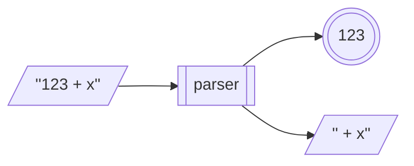

# Agenda

- The problem
- Monad transformers
- State transformer monad
- Parsing
- Other transformers and monad stacks

---

# The problem

We've amassed a bunch of really useful monads:

- `[]`
- `Maybe`
- `Logger`
- `State`
- `IO`

<!-- pause -->

But there's no way to *combine* the effects of one with another!

<!-- pause -->

E.g., we might want to combine a `Logger` monad with a list (`[]`) monad to log
each step taken in a non-deterministic operation.

E.g., we might want to combine a `State` monad with a `Maybe` monad to model
stateful computations that might fail.

---

# A naive solution

We could try to combine monads by directly embedding them. E.g., for `State` and
`Maybe`:

```haskell
type StatefulMaybe a = State s (Maybe a)
```

What does this describe? Is this a stateful computation that might fail?

<!-- pause -->

- No! Failure isn’t part of the monad; it’s just a value in the result. The
  state is still updated and propagated regardless of success or failure.

- We would like failure to *short-circuit* the computation: if something fails,
  the computation should stop and the state shouldn't be updated further.

<!-- pause -->

We want to *compose* the effects of `State` and `Monad`, rather than just embed
the latter in the first!

---

# Monad transformers

A monad transformer allows you to *stack monadic effects* by wrapping one monad
around another.

- More concretely, a monad transformer takes a monad `m`, and returns a new
  monad `t m` that adds an effect to that monad.

<!-- pause -->

E.g., consider the original `State` type:

```haskell
newtype State s a = State { runState :: s -> (a, s) }
```

<!-- pause -->

The `StateT` monad transformer generalizes this by letting the output live
inside another monad `m`:

```haskell
newtype StateT s m a = StateT { runStateT :: s -> m (a, s) }
```

- `m` is the *base* or *inner* monad
- the `Functor`, `Applicative`, and `Monad` instances must carefully *thread
  state* and also *sequence effects* from `m`

---

# State monad transformer

```haskell
newtype StateT s m a = StateT { runStateT :: s -> m (a, s) }
```

E.g., we could stack `StateT` with the `Maybe` monad to define a stateful
computation that might fail, like so:

```haskell
pop :: StateT [a] Maybe a
pop = StateT $ \s -> case s of
                       [] -> Nothing
                       (x:xs) -> Just (x, xs)

push :: a -> StateT [a] Maybe ()
push x = StateT $ \s -> Just ((), x:s)
```

---

# State monad transformer

## Functor/Applicative/Monad instances

Here's the original `State` instance of `Functor`:

```haskell
instance Functor (State s) where
  fmap :: (a -> b) -> State s a -> State s b
  fmap f (State st) = State $ \s -> let (x, s') = st s
                                    in (f x, s')
```

<!-- pause -->

The `StateT` instance needs to do the same, while also sequencing the inner
monad:

```haskell
instance (Monad m) => Functor (StateT s m) where
  fmap :: (a -> b) -> StateT s m a -> StateT s m b
  fmap f (StateT st) = StateT $ \s ->  do (x, s') <- st s
                                          return (f x, s')
```

<!-- pause -->

Can you implement the `Applicative` and `Monad` instances of `StateT`?

---

# State monad transformer

With working instances, we can now do:

```haskell
stackOps :: StateT [Int] Maybe ()
stackOps = push 1 >> pop >> pop >> push 2


-- use stackOps

runStateT stackOps [1]  ==  Just ((), [2])

runStateT stackOps []   ==  Nothing
```

- In this example, `Maybe` handles failure (e.g., popping from an empty stack)
- `StateT` keeps track of the stack across steps

---

# Parsing

A *parser* is a stateful computation that takes as its input state a string, and
attempts to extract (parse) a structured value from the beginning of that
string, and returns the remaining unconsumed input string along with the parsed
value.

E.g., an integer parser run on an input string:



<!-- pause -->

A parser is just a `State` + `Maybe` monad stack!

```haskell
type Parser a = StateT String Maybe a
```

---

# Parsing

A single character parser:

```haskell
char :: Parser Char
char = StateT $ \s -> case s of ""     -> Nothing
                                (c:cs) -> Just (c,cs)

parse = runStateT -- for legibility
```

<!-- pause -->

So we can do:

```haskell
parse char ""  ==  Nothing

parse char "hello"  ==  Just ('h',"ello")
```

---

# Parsing

Because `Parser`s are monads, we can write:

```haskell
threeChars :: Parser (Char,Char,Char)
threeChars = do c1 <- char
                c2 <- char
                c3 <- char
                return (c1,c2,c3)

parse threeChars "hello"  ==  Just (('h','e','l'),"lo")
```

---

# Parsing

## Basic parsers

Parsing a character using a predicate:

```haskell
sat :: (Char -> Bool) -> Parser Char
sat p = do c <- char
           if p c then return c else fail

fail :: Parser a
fail = StateT $ \s -> Nothing
```

<!-- pause -->

So we can do:

```haskell
parse (sat (== 'a')) "hello"  ==  Nothing

parse (sat (== 'a')) "aloha"  ==  Just ('a',"loha")

parse (sat isDigit)  "aloha"  ==  Nothing

parse (sat isDigit)  "123"    ==  Just ('1',"23")
```

---

# Parsing

## Basic parsers

We can use `sat` to write some more parsers:

```haskell
string :: String -> Parser String
string "" = return ""
string (x:xs) = do sat (== x)
                   string xs
                   return (x:xs)
```

<!-- pause -->

So we can do:

```haskell
parse (string "hello") "hello world"  ==  Just ("hello"," world")

parse (string "hello") "aloha world"  ==  Nothing
```

---

# Parsing

## Utility functions

We can implement some utility functions that combine parsers:

```haskell
(<|>) :: Parser a -> Parser a -> Parser a
p <|> q = StateT $ \s -> case parse p s of
                           Nothing -> parse q s
                           Just x  -> Just x

oneOrMore :: Parser a -> Parser [a]
oneOrMore p = do x <- p 
                 xs <- oneOrMore p <|> return []
                 return $ x:xs

zeroOrMore :: Parser a -> Parser [a]
zeroOrMore p = oneOrMore p <|> return []
```

<!-- pause -->

So we can do:

```haskell
parse (string "hi" <|> string "bye") "bye!" ==  Just ("bye","!")

parse (oneOrMore $ sat isDigit) "123hi"     ==  Just ("123","hi")

parse (zeroOrMore $ sat isSpace) "  bye!"   ==  Just ("  ","bye!")
```

---

# Parsing

## More parsers

And now we can implement more complex parsers!

```haskell
int :: Parser Int
int = do cs <- oneOrMore (sat isDigit)
         return (read cs)

token :: Parser a -> Parser a
token p = do zeroOrMore $ sat isSpace
             x <- p
             zeroOrMore $ sat isSpace
             return x

symbol :: String -> Parser String
symbol s = token (string s)
```

<!-- pause -->

So we can do:

```haskell
parse int "123 + x"                ==  Just (123," + x")

parse (token int) "  123 + x"      ==  Just (123,"+ x")

parse (symbol "foo") "  foo = 10"  ==  Just ("foo","= 10")
```

---

# Parsing

## Expression parser

Let's write a program to parse and evaluate simple arithmetic expressions.

Start with a data type for representing expressions:

```haskell
data Expr = Lit Int | Add Expr Expr | Sub Expr Expr
```

<!-- pause -->

So an expression like `(5 + 10) - (20 - 2)` would be represented as:

```haskell
Sub (Add (Lit 5) (Lit 10))
    (Sub (Lit 20) (Lit 2))
```

---

# Parsing

## Expression parser

Can you finish implementing the parser?

```haskell
expr :: Parser Expr
expr = do t1 <- term
          op <- sat (== '+') <|> sat (== '-')
          t2 <- term
          return $ (if op == '+' then Add else Sub) t1 t2
       <|>
       term

term :: Parser Expr
term = ?
```

Such that:

```haskell
parse expr "(5+10)-(20-2)" == Just (Sub (Add (Lit 5) (Lit 10))
                                        (Sub (Lit 20) (Lit 2)),"")

parse expr "42+x" == Just (Lit 42,"+x")

parse expr "(1+2" == Nothing
```

---

# Parsing

## Expression parser

Now the evaluator:

```haskell
eval :: Expr -> Int
eval (Lit i)     = i
eval (Add e1 e2) = eval e1 + eval e2
eval (Sub e1 e2) = eval e1 - eval e2
```

<!-- pause -->

Can you implement `evalString`?

```haskell
evalString :: String -> Maybe Int
evalString = ?
```

Such that:

```haskell
evalString "(5+10)-(20-2)"  ==  Just (-3)

evalString "42+x"           ==  Nothing

evalString "(1+2"           ==  Nothing
```

---
